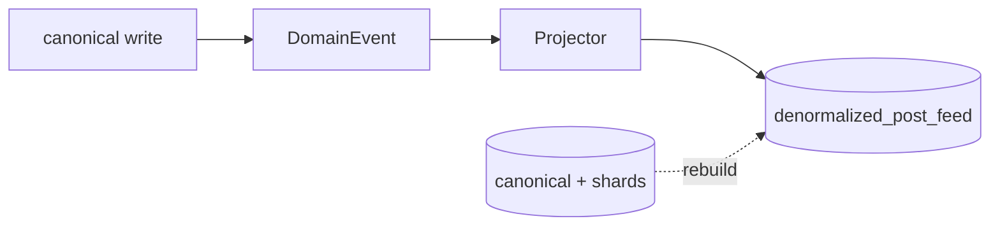

# Denormalization (Member 3)

## Problem

A feed row needs the author's name and the like/comment counters. Fully
normalized that is:

```sql
SELECT p.post_id, u.username, p.content,
       (SELECT count(*) FROM likes    l WHERE l.post_id = p.post_id),
       (SELECT count(*) FROM comments c WHERE c.post_id = p.post_id)
FROM posts p JOIN users u ON u.user_id = p.user_id
ORDER BY p.created_at DESC LIMIT 20;
```

Fast to write, expensive to read, and impossible to keep cheap once the data is
sharded (the join would have to cross shards).

## Implementation

* Table: `denormalized_post_feed` (`post_id`, `user_id`, `author_username`,
  `content`, `visibility`, `like_count`, `comment_count`, `created_at`).
* Projector: `services/denormalization/projector.py`, subscribed to
  `POST_CREATED`, `POST_UPDATED`, `POST_DELETED`, `LIKE_CREATED`,
  `LIKE_DELETED`, `COMMENT_CREATED`.
* Mode: enabled with `DENORMALIZED_ENABLED=true` (or `MODE=DENORMALIZED`,
  `FULL_DISTRIBUTED`).
* Rebuild: `POST /api/v1/read-model/rebuild` scatters over the shards and joins
  in the API process (a per-shard join would miss cross-shard authors), then
  truncates and refills the table.



## Status

| Piece | Status |
| --- | --- |
| Projection table + event-driven updates | IMPLEMENTED |
| Full rebuild from canonical PostgreSQL (shard-aware) | IMPLEMENTED |
| Counters maintained incrementally | IMPLEMENTED |
| Multi-table/materialized-view projections | NOT IMPLEMENTED |

## Trade-offs

| Wins | Costs |
| --- | --- |
| feed reads without joins or count subqueries | write amplification (every like/comment updates a row) |
| works when data is spread over shards | eventual consistency — the projection can lag behind |
| rebuildable, so a bug is never permanent | extra storage and one more thing to monitor |

## Demo

1. Create a post, like it, comment on it.
2. `GET /api/v1/read-model/posts` shows the row with counters already filled.
3. `POST /api/v1/read-model/rebuild` reports how many rows were rebuilt from
   PostgreSQL — the number is counted, never assumed.
4. `/benchmarks` → compare `denormalized_read` with `normalized_read` (both
   measured live).

## Do not claim

That the projection is a source of truth, or that it is always up to date.
