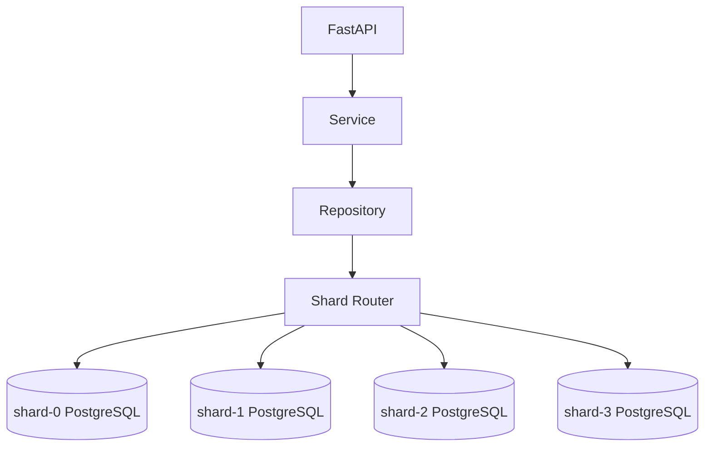
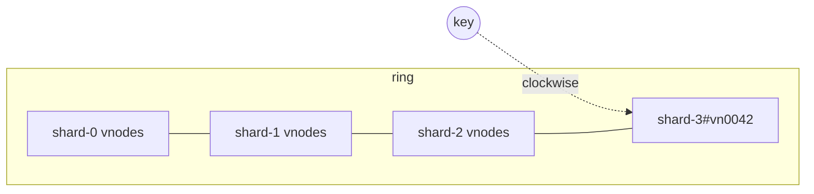

# Sharding in MetaScale (Member 4 — ShardRouter)

This document explains horizontal sharding as implemented in this repository.
Every claim here is backed by runnable code in `services/shard-router/` and
tests under `tests/` and `services/shard-router/tests/`.

Labels follow the project convention:

- **IMPLEMENTED** — works against real, independent PostgreSQL instances.
- **SIMULATION** — an educational stand-in that does not fake the parts that
  matter (e.g. the `simulate-down` endpoint flips the same health flag a real
  failed probe would).

---

## 1. What is horizontal sharding?

**Vertical scaling** buys a bigger database server. **Horizontal sharding**
splits the rows of a table across multiple independent database servers
(*shards*), each holding a disjoint subset of the data. Every shard in
MetaScale is a separate PostgreSQL 16 container (`postgres-shard-0…3`, plus a
spare `…-4`) running the **same** relational schema.



## 2. Why normalization alone does not give physical scalability

A normalized (~3NF) schema removes *update anomalies* and duplication, but it
says nothing about *where rows physically live*. A single normalized
PostgreSQL instance still has one CPU/memory/IO ceiling and one network
endpoint. Normalization is a **logical** design; sharding is a **physical**
distribution design. The two compose: MetaScale shards an *unchanged*
normalized schema.

## 3. The shard key

A shard key is the column whose value determines a row's shard. A good key:

1. is present on every write,
2. is immutable,
3. maximizes **locality** for the hottest access paths, and
4. spreads keys (and, ideally, load) evenly.

### Access-pattern-aware mapping (configurable)

We do **not** blindly hash every table's primary key. The mapping lives in
`router/shard_router.py::DEFAULT_ENTITY_SHARD_KEYS` and can be overridden via
the `ShardRouter(entity_shard_keys=...)` constructor.

| Entity | Shard key | Why |
|---|---|---|
| users | `id` | users are addressed directly by id |
| profiles | `user_id` | 1:1 with a user → co-located with it |
| posts | `author_id` | author timelines are the dominant read; co-locates posts with the author |
| comments | `post_id` | "comments of a post" stays on the post's shard |
| likes | `post_id` | like lists and like counts stay with the post |
| follows | `follower_id` | a user's *outgoing* graph stays together |
| media | `owner_id` | a user's uploads stay together |
| notifications | `recipient_id` | the recipient's inbox stays together |

Co-located references keep **hard foreign keys** (e.g. `posts.author_id →
users.id`, `comments.post_id → posts.id`). References that may cross shards
(`comments.user_id`, `likes.user_id`, `follows.following_id`,
`notifications.actor_id`) deliberately have **no FK** and are assembled in
the application (see cross-shard joins, §11).

### Key alignment

A post is written using `author_id` as the routing key but later read by its
own primary key. The writer therefore picks a post id whose hash lands on the
author's shard (`ShardRouter.generate_key_routed_to`). Then
`route(post.id) == route(author_id)`, so point reads by either value hit one
shard. The deterministic seeder applies the same technique to media.

## 4. Hash sharding (modulo) — IMPLEMENTED

```
shard = stable_hash(key) mod N
```

Python's built-in `hash()` is **never** used: it is salted per process
(`PYTHONHASHSEED`), so a row written by one process could be sought on a
different shard by another. Instead `router/hash_router.py` implements a
pure-Python **MurmurHash3 x86_32** (seed 0), stable across processes, machines,
and Python versions, with SHA-256/MD5 alternatives.

`GET /api/v1/shards/route/user/12345?strategy=hash`

```json
{ "key": "12345", "shard_id": "shard-2", "strategy": "hash", "shard_count": 4 }
```

**The modulo problem.** With `h(k) mod N`, changing `N` re-homes almost every
key. Measured by `benchmark_hash.py` over 100,000 keys, 4 → 4→5 moves
**79.84%** of keys (theory: `1 − 1/5 = 80%`). That is a massive migration for
one capacity increment.

## 5. Consistent hashing — IMPLEMENTED

A consistent-hash ring places many *virtual node* points on a 0…2³² circle; a
key is owned by the first vnode encountered clockwise from the key's hash
(`router/consistent_hash.py`). Adding a physical shard only claims the arc
segments immediately clockwise of its new vnodes, so only ~`1/(N+1)` of keys
move. The same benchmark measured **23.05%** movement for 4 → 5 with 150
vnodes (theory 20%).



Supported operations: add shard, remove shard, route key, and compute affected
keys (`ConsistentHashRing.planned_movement_for_add` builds a *shadow* ring so
planning never mutates live routing). Removing a newly added shard restores
100% of prior ownership (asserted in tests).

## 6. Virtual nodes — IMPLEMENTED

Each physical shard owns `VIRTUAL_NODES_PER_SHARD` (default 150) ring points
named `shard-2#vn0007`, each hashed independently. More vnodes → many small
owned arcs → even distribution and smooth movement. Real measurements from
`benchmark_consistent_hash.py` over 100,000 keys across 4 shards:

| vnodes/shard | spread (max%−min%) | stdev (pp) |
|---:|---:|---:|
| 1 | 38.56 | 17.94 |
| 25 | 3.23 | 1.18 |
| 150 | **1.71** | **0.75** |
| 500 | 2.29 | 0.90 |

See `benchmarks/results/samples/benchmark_consistent_hash.json`.

## 7. Shard metadata registry — IMPLEMENTED

`metadata/registry.py` defines the abstract `MetadataRegistry` (a future
etcd/consul/topology service can replace it) and an in-memory implementation
seeded from `SHARD_n_URL`. Each `ShardMetadata` carries id, host/port/database,
status (`HEALTHY`, `DEGRADED`, `UNAVAILABLE`, `REBALANCING`, `BOOTSTRAPPING`),
capacity, row count, load fraction, virtual-node count, and timestamps. An
optional durable repository (`metadata/repository.py`) audits registry state
and migrations into operational tables on the canonical PostgreSQL.

## 8. Connection management — IMPLEMENTED

`db/shard_engine.py::ShardEngineManager` owns **one independent pooled
SQLAlchemy engine per shard**, created lazily. There is no shared global
connection pretending to be sharded. It handles connection refusal, timeouts,
and pool-queue exhaustion by marking the shard down and raising a structured
`ShardUnavailableError` (HTTP 503).

**Member 5 boundary.** `ShardConnectionProvider` decides *which endpoint
inside the chosen shard* to use. The current `PrimaryOnlyProvider` returns the
single primary. Member 4 chooses the shard; Member 5 will choose primary vs
replica by replacing this provider — routing logic is untouched.

## 9. Targeted queries — IMPLEMENTED

When the routing key is known, exactly one shard is contacted
(`queries/targeted.py`). The executor records routing latency, database
latency, total latency, the vnode, and the query type.

`GET /api/v1/sharded/users/101` → route → **one** shard → row, plus:

```json
"routing": { "shard_contacted": "shard-3", "routing_latency_ms": 0.04,
             "database_latency_ms": 12.4, "total_latency_ms": 12.6,
             "query_type": "targeted" }
```

CRUD for users and posts (`create/get/update/delete`) is routed
automatically; the API caller never supplies a shard id.

## 10. Scatter-gather — IMPLEMENTED

A query without a routing key — "latest posts across **all** users" — cannot
be localized. `queries/scatter_gather.py` fans out to every healthy shard
**concurrently** (`asyncio.gather`), gathers per-shard top-N rows, and merges,
globally sorts, and applies the limit in the application. It reports
`shards_contacted`, per-shard rows/latency/status, `execution_time_ms`,
`merge_time_ms`, `total_latency_ms`, and any unavailable shards.

This demonstrates the trade-off honestly: targeted reads touch one shard;
scatter-gather touches **all** of them (measured in benchmark scenario C,
which is markedly slower and costs N fan-out connections per request).

## 11. Cross-shard joins — IMPLEMENTED (application-side)

A local SQL `JOIN` cannot span independent PostgreSQL servers.
`queries/cross_shard.py` groups required rows by owning shard, issues
concurrent targeted hops, and stitches records in the application. The demo
endpoint `GET /api/v1/sharded/posts/{id}/cross-shard` fetches a post, its
comments, and every commenter's user row (which may live elsewhere), and
reports `network_hops`, the distinct `shards_contacted`, and latency. It is
explicitly labeled as an application join, not a SQL join.

## 12. Hot shards and the celebrity problem — IMPLEMENTED

Even distribution of **keys** does not guarantee even **load**. If one user is
famous, requests for that user all hash to the same shard regardless of how
fair the ring is. `hotspots/detector.py` flags a shard when, beyond a minimum
request volume, its share of traffic exceeds a threshold (default 40%) or it
is ≥1.8× the mean of its peers. `metrics/collector.py` tracks requests/sec,
reads/writes, errors, average/P50/P95/P99 latency, active connections, rows,
scatter/cross-shard counters, and migration metrics.

`POST /api/v1/shards/demo/hot-user/42?requests=500&skew=0.9` generates **real**
skewed targeted traffic; a measured run put ~85–90% of requests on one shard
and triggered the detector. This is the fundamental lesson: a good shard key
does not protect against skewed access patterns.

## 13. Online rebalancing — IMPLEMENTED (educational)

`rebalance/` implements adding a shard with explicit, audited phases and **no
silent deletion**:

```mermaid
sequenceDiagram
    participant P as Planner
    participant Src as Source shards
    participant Dst as New shard
    participant R as Router
    P->>P: build plan on a shadow ring (live ring untouched)
    P->>Src: scan real shard-key values; decide moves
    loop each table (parent first)
        Src->>Dst: COPY rows (batched, idempotent ON CONFLICT DO NOTHING)
        Src-->>Dst: VERIFY row count + PK set + content checksum
    end
    Note over R: switch ownership ONLY if all checksums match
    R->>R: add new shard to the live ring
    Src->>Src: delete migrated rows (child first) AFTER switch
```

Phases: `PLANNED → COPYING → VERIFYING → SWITCHING → COMPLETED`; any failure →
`FAILED`/`ABORTED`. `ChecksumVerifier` compares row count, the ordered primary
key set, and an md5 content digest of the migrated subset. On mismatch it
raises `ChecksumMismatchError`, the live ring is **not** changed, and no
source data is deleted (covered by a test that intentionally drops half the
copied rows). A `dry_run` returns the movement plan without copying
(SIMULATION). The live path copies real rows between real PostgreSQL shards
(IMPLEMENTED, demonstrated by scenario E and the `/shards/rebalance` endpoint).

## 14. Failure handling — IMPLEMENTED detection; failover reserved

A failed `SELECT 1` health probe marks the shard `UNAVAILABLE`
(`health/health_checker.py`); targeted requests then return a structured 503,
while scatter-gather reports the failed shard per-shard and still returns the
others. The dev-only `POST /shards/{id}/simulate-down` (SIMULATION) forces this
state for demos; `POST /shards/{id}/health-check` restores it. **No replication
or failover is implemented** — that is Member 5's job behind
`ShardConnectionProvider`.

## 15. Trade-offs at a glance

| Technique | Strength | Cost |
|---|---|---|
| Modulo hash | trivial, even | re-homes ~80% of keys on +1 shard |
| Consistent hash + vnodes | ~1/(N+1) movement, even spread | ring bookkeeping; vnode memory |
| Targeted query | one shard, low latency | requires the routing key |
| Scatter-gather | any global query | N fan-outs + merge; partial-failure handling |
| Cross-shard join | works across shards | multiple network hops; no SQL join/constraint |
| Sharding | horizontal capacity/throughput | operational complexity; transactions/joins/global uniqueness are harder |

Global ID uniqueness is handled with application-assigned 63-bit Snowflake-like
ids (`db/ids.py`) in sharded mode; canonical mode uses database sequences.
