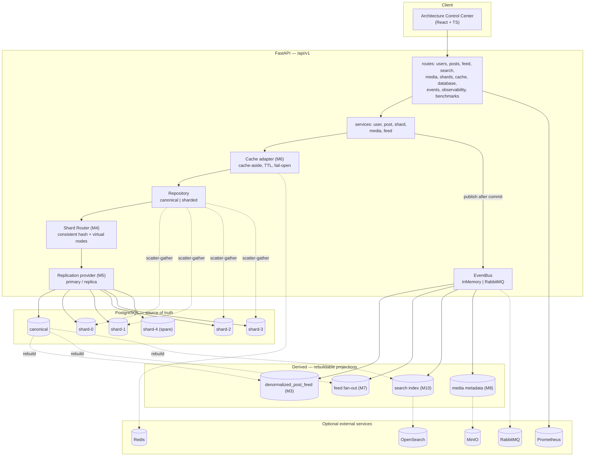
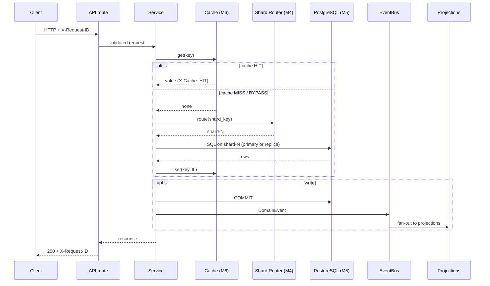
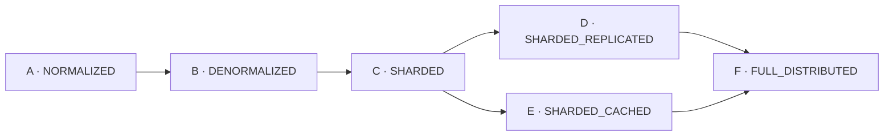
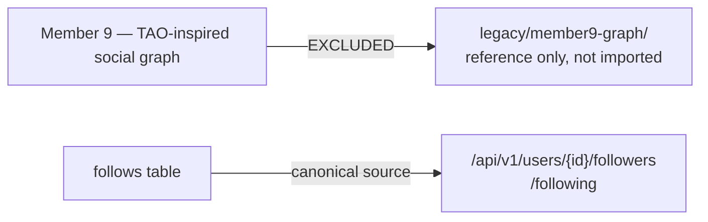

# Architecture (Mermaid)

Machine-readable companion to [ARCHITECTURE.md](ARCHITECTURE.md). Every box is
code that exists in this repository; dashed boxes are external services that are
optional and fail-open.

> Educational/research project inspired by publicly discussed database and
> infrastructure concepts. Not affiliated with, endorsed by, or a reproduction
> of Meta's proprietary systems.

## System overview

## Request path (the 7 steps the UI animates)

## Deployment modes

| Mode | Adds |
| --- | --- |
| A | canonical PostgreSQL, joins on read |
| B | denormalized read model, event-driven |
| C | shard router over independent PostgreSQL shards |
| D | read replicas inside each shard |
| E | Redis cache-aside above the repository |
| F | sharding + replicas + cache + derived systems together |

## Excluded this iteration

