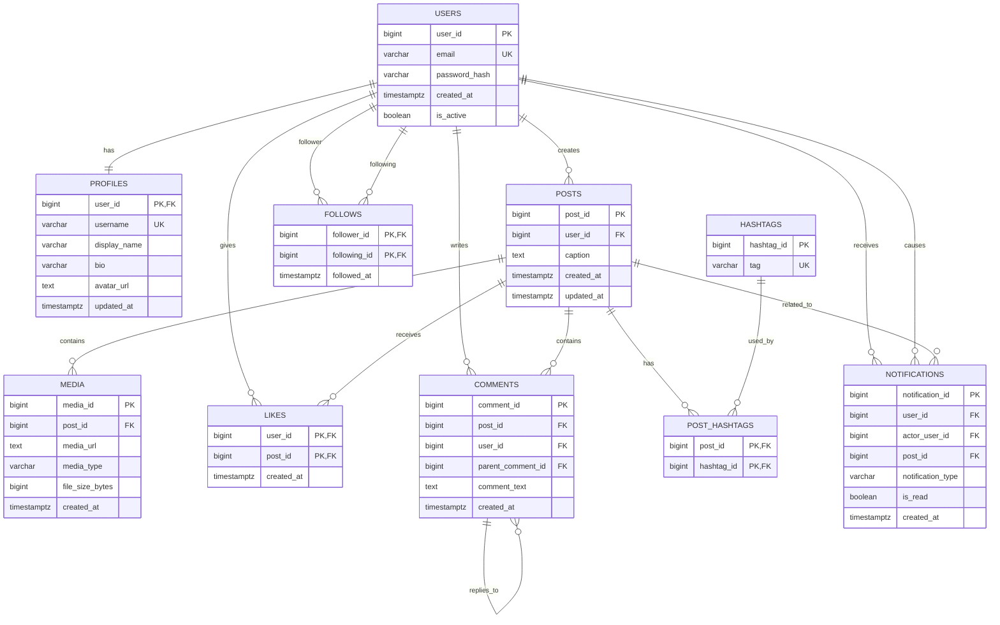

# ER Diagram

The diagram below can be pasted into GitHub Markdown because GitHub supports Mermaid diagrams.

```mermaid
erDiagram

    USERS ||--|| PROFILES : has
    USERS ||--o{ POSTS : creates
    POSTS ||--o{ MEDIA : contains

    USERS ||--o{ FOLLOWS : follower
    USERS ||--o{ FOLLOWS : following

    USERS ||--o{ LIKES : gives
    POSTS ||--o{ LIKES : receives

    USERS ||--o{ COMMENTS : writes
    POSTS ||--o{ COMMENTS : contains
    COMMENTS ||--o{ COMMENTS : replies_to

    POSTS ||--o{ POST_HASHTAGS : has
    HASHTAGS ||--o{ POST_HASHTAGS : used_by

    USERS ||--o{ NOTIFICATIONS : receives
    USERS ||--o{ NOTIFICATIONS : causes
    POSTS ||--o{ NOTIFICATIONS : related_to

    USERS {
        bigint user_id PK
        varchar email UK
        varchar password_hash
        timestamptz created_at
        boolean is_active
    }

    PROFILES {
        bigint user_id PK, FK
        varchar username UK
        varchar display_name
        varchar bio
        text avatar_url
        timestamptz updated_at
    }

    POSTS {
        bigint post_id PK
        bigint user_id FK
        text caption
        timestamptz created_at
        timestamptz updated_at
    }

    MEDIA {
        bigint media_id PK
        bigint post_id FK
        text media_url
        varchar media_type
        bigint file_size_bytes
        timestamptz created_at
    }

    FOLLOWS {
        bigint follower_id PK, FK
        bigint following_id PK, FK
        timestamptz followed_at
    }

    LIKES {
        bigint user_id PK, FK
        bigint post_id PK, FK
        timestamptz created_at
    }

    COMMENTS {
        bigint comment_id PK
        bigint post_id FK
        bigint user_id FK
        bigint parent_comment_id FK
        text comment_text
        timestamptz created_at
    }

    HASHTAGS {
        bigint hashtag_id PK
        varchar tag UK
    }

    POST_HASHTAGS {
        bigint post_id PK, FK
        bigint hashtag_id PK, FK
    }

    NOTIFICATIONS {
        bigint notification_id PK
        bigint user_id FK
        bigint actor_user_id FK
        bigint post_id FK
        varchar notification_type
        boolean is_read
        timestamptz created_at
    }
```
